<div align="center">

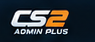

<h1>CS2 Admin Plus</h1>

<p><strong>A CS2-native web control panel for live server administration.</strong></p>

<p>Manage players, teams, maps, practice tools, bots, match state and raw RCON from one interface built around Counter-Strike 2's visual language.</p>

<p>
  
  
  
  
  
</p>

<p>
  <a href="#one-panel-for-the-whole-server">Features</a> ·
  <a href="#player-administration">Screenshots</a> ·
  <a href="#architecture">Architecture</a> ·
  <a href="#setup">Setup</a> ·
  <a href="#build-and-deploy-the-counterstrikesharp-plugin">Plugin</a>
</p>

</div>

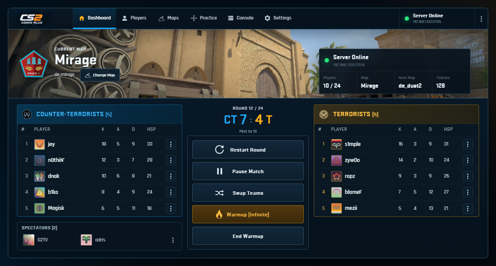

<p align="center"><sub>Presentation screenshots use the built-in demo mode; live mode is populated from the connected CS2 server.</sub></p>

### Cinematic login experience

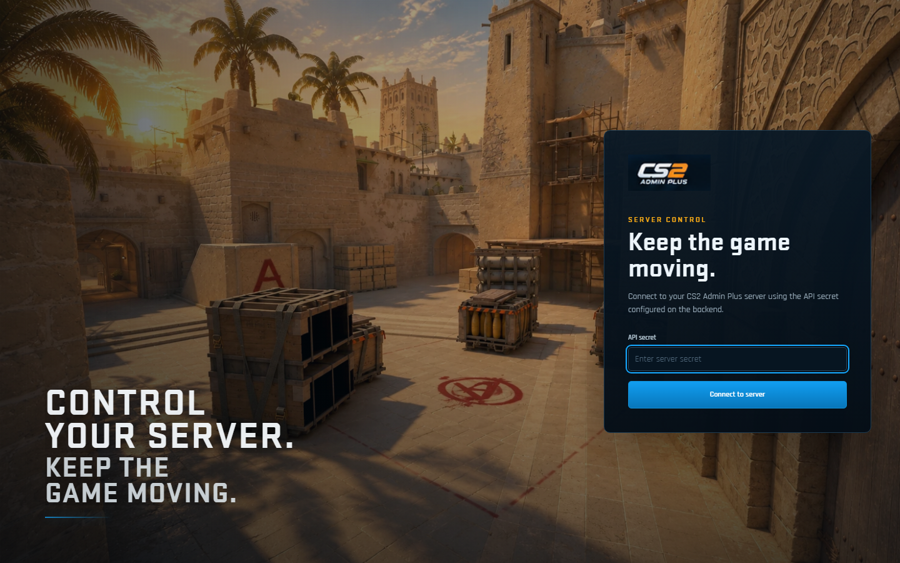

The login rotates through Mirage, Nuke, Overpass and Ancient with long crossfades, subtle scene motion and a one-time load-in for the server-control headline. Reduced-motion users get a static background with the same layout and readability.

## One panel for the whole server

CS2 Admin Plus combines a React/Vite frontend, an authenticated Express API, an RCON bridge and a CounterStrikeSharp plugin. The result is a click-first admin surface for the tasks that normally require console commands, separate tools or repeated context switching.

| Surface | What it controls |
| --- | --- |
| **Live dashboard** | Current map, server health, CT/T rosters, spectators, round score and match controls |
| **Players** | Team, HP, money, alive/dead state, ping, respawn, freeze, god mode, weapons, slap and kick |
| **Practice** | Infinite ammo, recoil/spread controls, utility, impacts, grenade trajectory, bot controls and presets |
| **Maps** | Installed-map discovery, native CS2 map previews, `changelevel` and Steam Workshop IDs |
| **Console** | Authenticated raw RCON, quick commands, returned output and per-session activity |
| **Identity** | SteamID64-aware full Steam avatars with cached lookup and CS2 avatar fallbacks |

## Player administration

Search and filter connected players, inspect team/HP/economy state, run bulk actions, or open a focused player control surface. Team changes are also available through drag-and-drop on the dashboard.

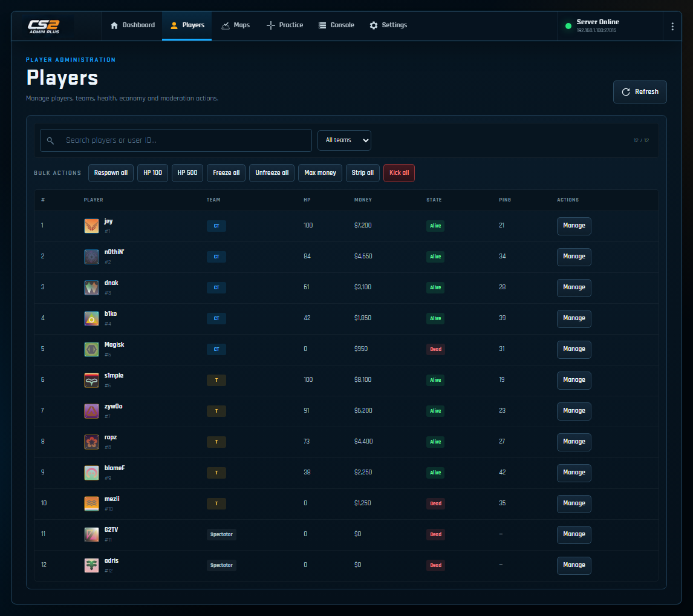

### Focused admin workflows

Detailed operations open in compact dialogs, keeping the live server context visible behind the task instead of sending the admin through another page.

<p align="center">
  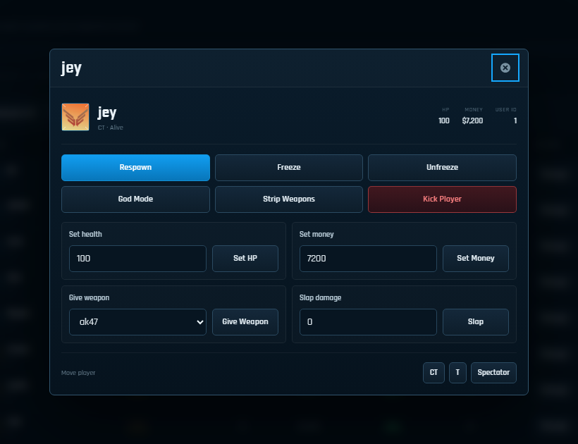
</p>

<p align="center"><sub>Player-specific health, economy, inventory, moderation and team controls.</sub></p>

## Practice, maps and server setup

The Practice workspace exposes common training and server-prep controls without asking an admin to memorize CVARs. The Maps workspace uses native CS2 map badges and 1080p map imagery while supporting installed maps, custom map names and Workshop IDs.

<p align="center">
  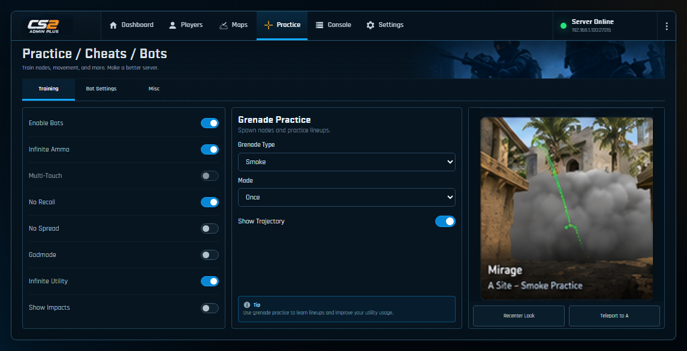
  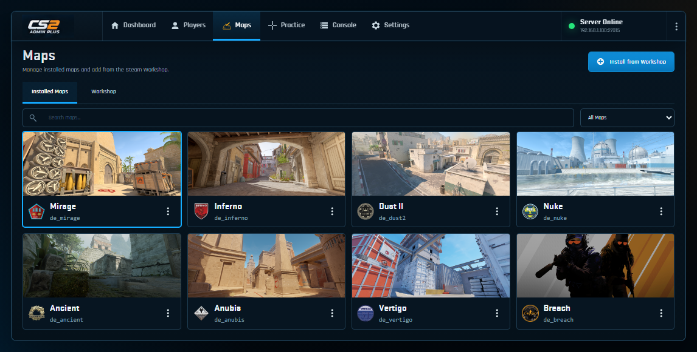
</p>

<p align="center">
  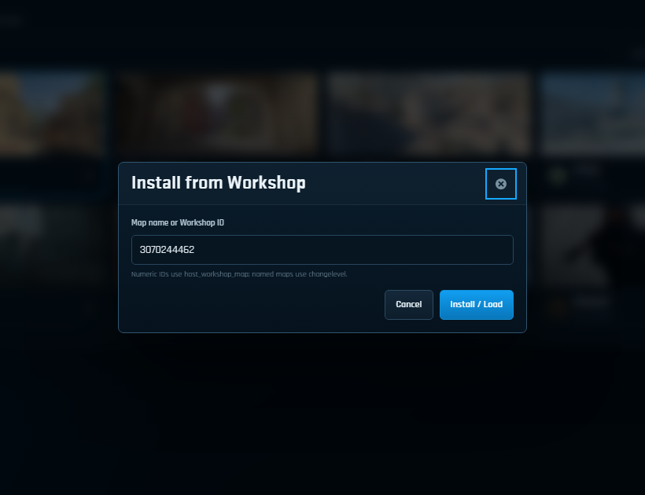
</p>

<p align="center"><sub>Load a numeric Steam Workshop ID or change directly to a named map.</sub></p>

<details>
<summary><strong>More Practice controls — bots, presets, match controls and round configuration</strong></summary>

<br>

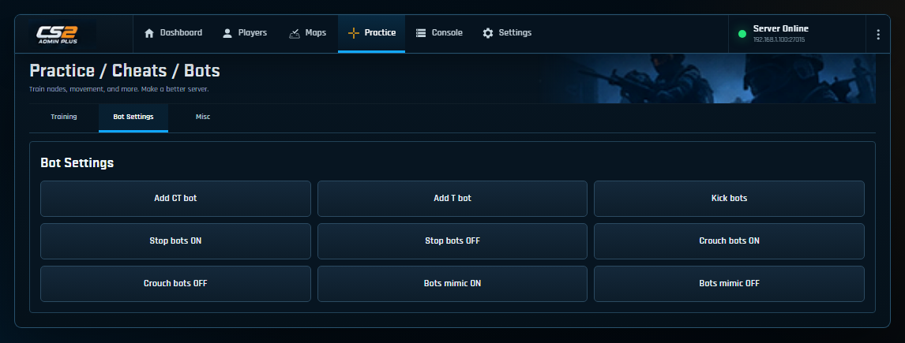

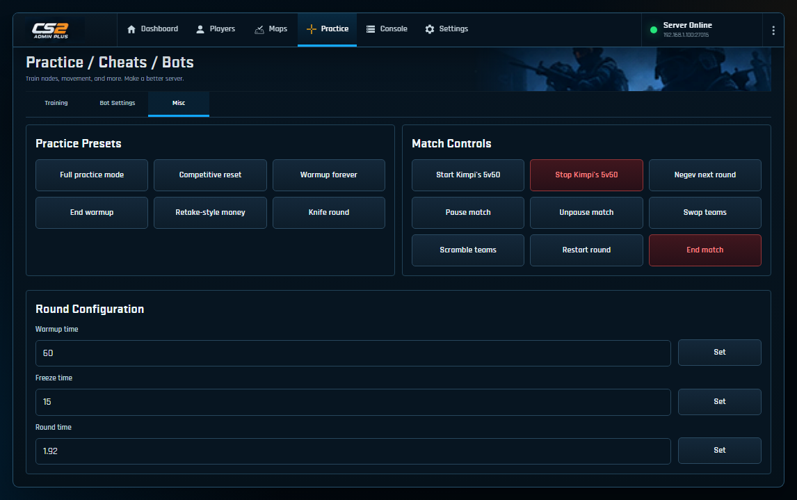

</details>

## Power-user tools and deployment state

The Console keeps raw RCON available for commands that do not need dedicated UI yet, while Session Activity records actions triggered through the panel. Settings surfaces connection state and the currently active deployment architecture.

<p align="center">
  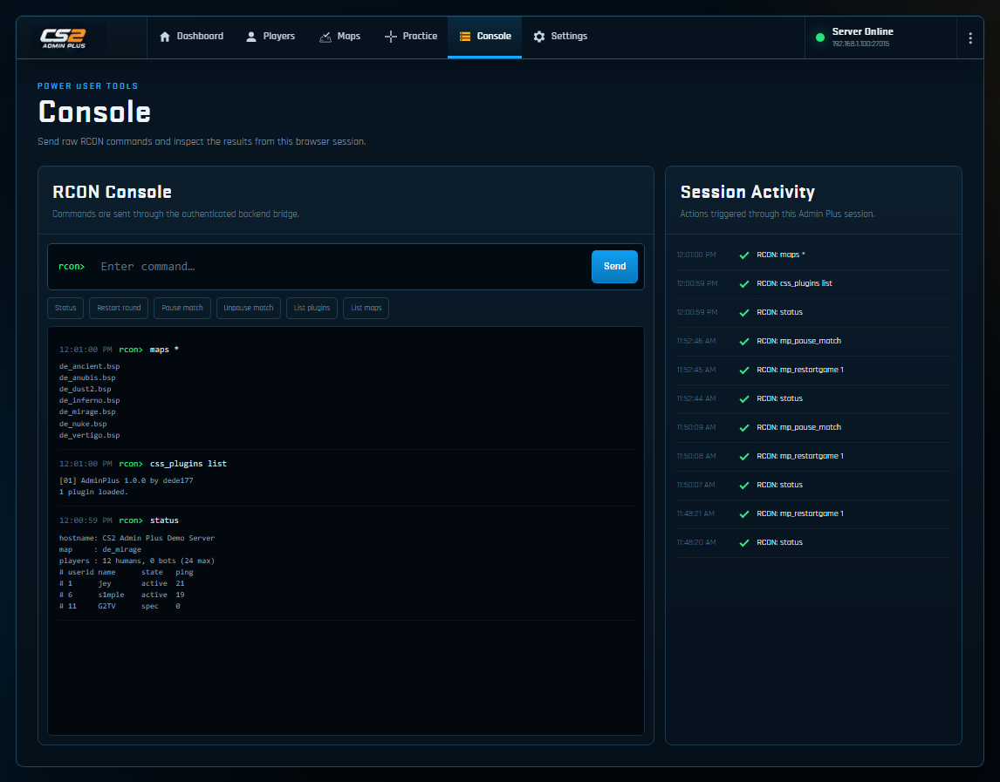
  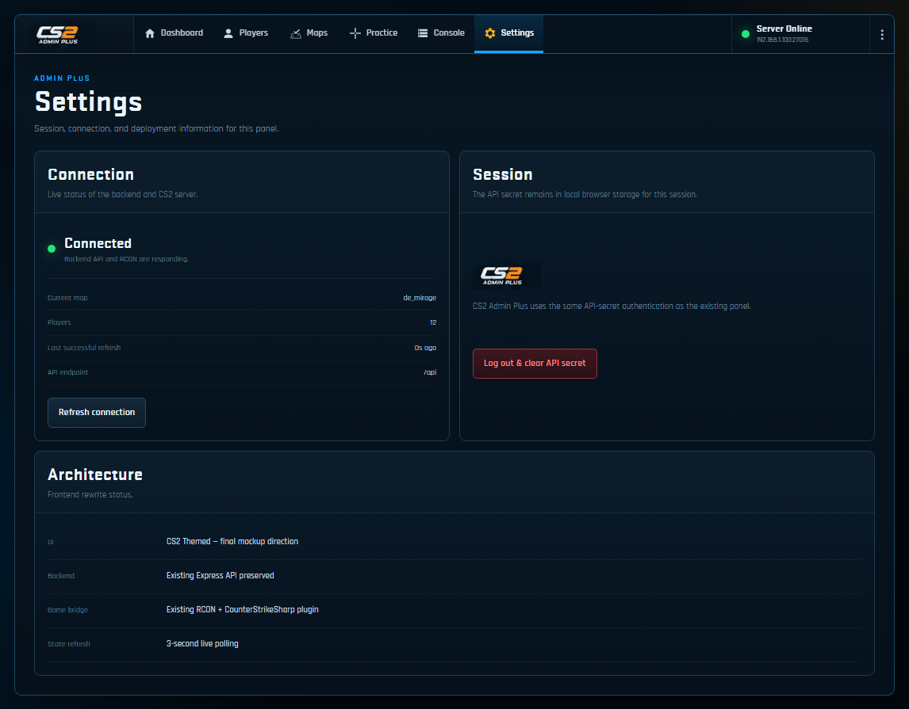
</p>

## Architecture

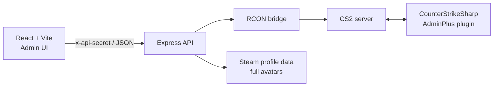

The production build is served by the Express process, so the panel and API can run as a single deployment. During development, Vite proxies `/api` and `/health` to the backend on port `3001`.

```text
cs2-admin-plus/
├── frontend/                 React + Vite admin UI
│   ├── src/pages/            Dashboard, Players, Maps, Practice, Console, Settings
│   ├── src/components/       Navigation, team tables, player actions, shared controls
│   ├── src/lib/              Map/avatar asset resolution
│   └── public/               CS2 icons, map art and presentation assets
├── backend/                  Express API + RCON bridge
│   └── src/routes/           Player and server endpoints
├── plugin/AdminPlus/         CounterStrikeSharp command bridge
└── docs/readme/              Repository presentation screenshots
```

## Key behavior

### Live match controls

The overview keeps the most time-sensitive controls in the center of the match board: restart round, pause, team swap and warmup. CT/T colors, native team logos, map identity and scoreboard hierarchy follow the CS2 presentation rather than a generic admin-dashboard theme.

### Player control bridge

The CounterStrikeSharp plugin exposes player-specific operations that plain RCON does not handle cleanly. Current commands include:

| Command | Purpose |
| --- | --- |
| `sm_playerinfo_all` | Player userid, name, team, HP, money, alive state and SteamID64 |
| `sm_respawn <userid>` | Respawn a player |
| `sm_setteam <userid> <ct\|t\|spec>` | Move a player between teams |
| `sm_givemoney <userid> <amount>` | Set player money |
| `sm_giveweapon <userid> <weapon>` | Give a weapon |
| `sm_sethp <userid> <hp>` | Set player HP |
| `sm_freeze <userid>` / `sm_unfreeze <userid>` | Freeze or unfreeze a player |
| `sm_stripweapons <userid>` | Remove player weapons |
| `sm_god <userid>` | Toggle god mode |
| `sm_slap <userid> [damage]` | Slap a player with optional damage |

Bulk money and weapon commands are also exposed by the plugin for all-player actions.

### Map discovery and Workshop loading

`GET /api/server/maps` combines:

1. Built-in official map names.
2. Optional `ADMINPLUS_MAPS` values.
3. `maps *` output from the running server when available.
4. `.vpk` / `.bsp` files discovered in configured or mounted map directories.

Named maps use `changelevel`; numeric Workshop IDs use `host_workshop_map`.

### Steam avatars with a local fallback

The plugin reports SteamID64 with player state. The backend resolves Steam's full avatar URL, caches successful lookups for 30 minutes and returns it with the player payload. If a Steam image is unavailable, the frontend assigns a stable 184×184 CS2 fallback portrait instead of leaving an empty avatar slot.

## Requirements

- Node.js 18+ and npm
- .NET 8 SDK to build the plugin
- A Counter-Strike 2 server with RCON enabled
- CounterStrikeSharp installed on the server for player-specific actions
- Network access from the backend to the game server's RCON endpoint

## Setup

Install frontend and backend dependencies:

```bash
npm run install:all
```

Create the backend environment file:

```bash
cp backend/.env.example backend/.env
```

On Windows PowerShell:

```powershell
Copy-Item backend/.env.example backend/.env
```

Configure at least the RCON connection and API secret:

```env
PORT=3001
RCON_HOST=your-server-host-or-ip
RCON_PORT=27015
RCON_PASSWORD=your_rcon_password
FRONTEND_URL=http://localhost:5173
API_SECRET=change_this_to_something_random
```

Optional map sources:

```env
ADMINPLUS_MAPS=de_cache,workshop/123456789/example_map
ADMINPLUS_MAP_DIRS=/path/to/your/server/maps
```

## Run

### Production-style local run

Build the frontend and start the Express server that serves both the API and `frontend/dist`:

```bash
npm run build
npm start
```

Open `http://localhost:3001` and sign in with the `API_SECRET` from `backend/.env`.

### Frontend + backend development

Run the backend:

```bash
npm --prefix backend run dev
```

Run Vite in another terminal:

```bash
npm --prefix frontend run dev -- --host 0.0.0.0
```

Vite serves the UI on `http://localhost:5173` and proxies API traffic to `http://localhost:3001`.

### UI demo mode without an RCON server

To inspect the complete interface with populated CS2 demo data, start the frontend with the explicit demo script:

```bash
npm --prefix frontend run dev:demo
```

Normal `npm --prefix frontend run dev` starts the live/authenticated panel. Demo mode bypasses live RCON calls while keeping the screens populated for UI development and review.

## Build and deploy the CounterStrikeSharp plugin

Build directly with the .NET SDK:

```bash
dotnet build plugin/AdminPlus/AdminPlus.csproj -c Release
```

The output DLL is created at:

```text
plugin/AdminPlus/bin/Release/net8.0/AdminPlus.dll
```

Copy that DLL to your server's CounterStrikeSharp plugin directory, then reload the plugin or restart the game server. The web panel will fall back to basic `status` parsing if the custom player-info command is unavailable, but the plugin is required for the full player-control feature set.

## API protection

All `/api/*` routes require the `x-api-secret` header and must match `API_SECRET`. Keep both `API_SECRET` and `RCON_PASSWORD` out of commits, screenshots and public logs. `backend/.env` is already ignored by Git.

## Credits and asset note

The visual direction is intentionally based on Counter-Strike 2's interface language. Native map/team/UI assets used by the panel were sourced from extracted CS2 Panorama resources, including the community-maintained [counter-strike-icons](https://github.com/Juknum/counter-strike-icons) collection.

Counter-Strike, Counter-Strike 2 and related game assets/trademarks are property of Valve Corporation. This project is an independent server administration tool and is not affiliated with or endorsed by Valve.

## Discoverability

Suggested GitHub Topics:

`counter-strike-2` · `cs2` · `cs2-server` · `counterstrikesharp` · `rcon` · `server-admin` · `server-management` · `game-server` · `admin-panel` · `steam-workshop` · `react` · `vite` · `express` · `csharp`

<p align="center"><sub>#CS2 · #CounterStrike2 · #CounterStrikeSharp · #RCON · #ServerAdmin · #GameServer · #SteamWorkshop</sub></p>
