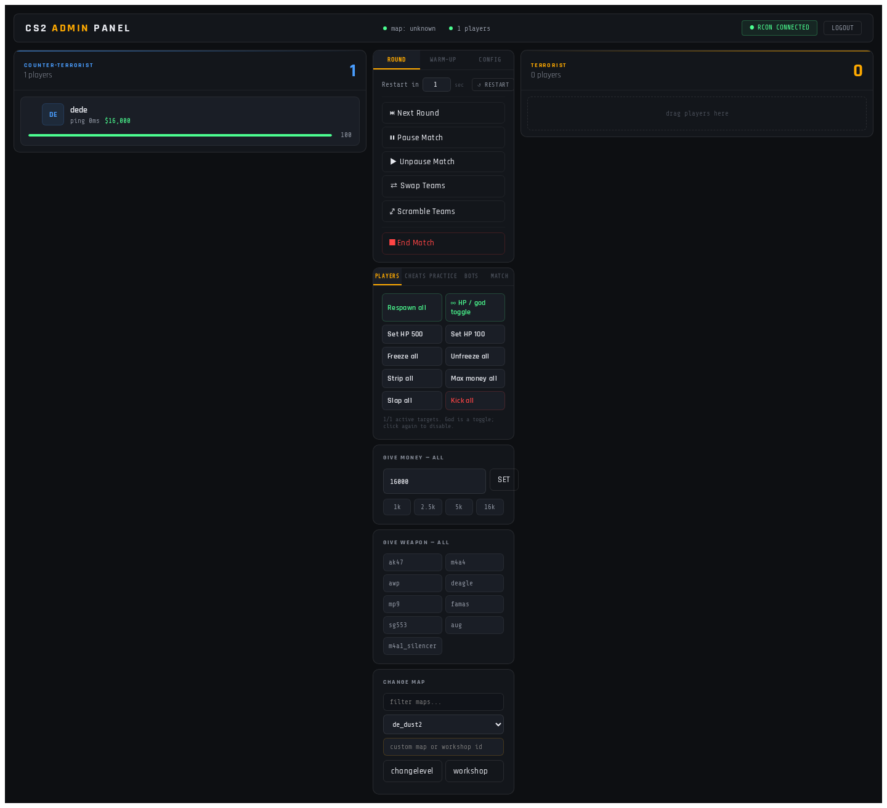
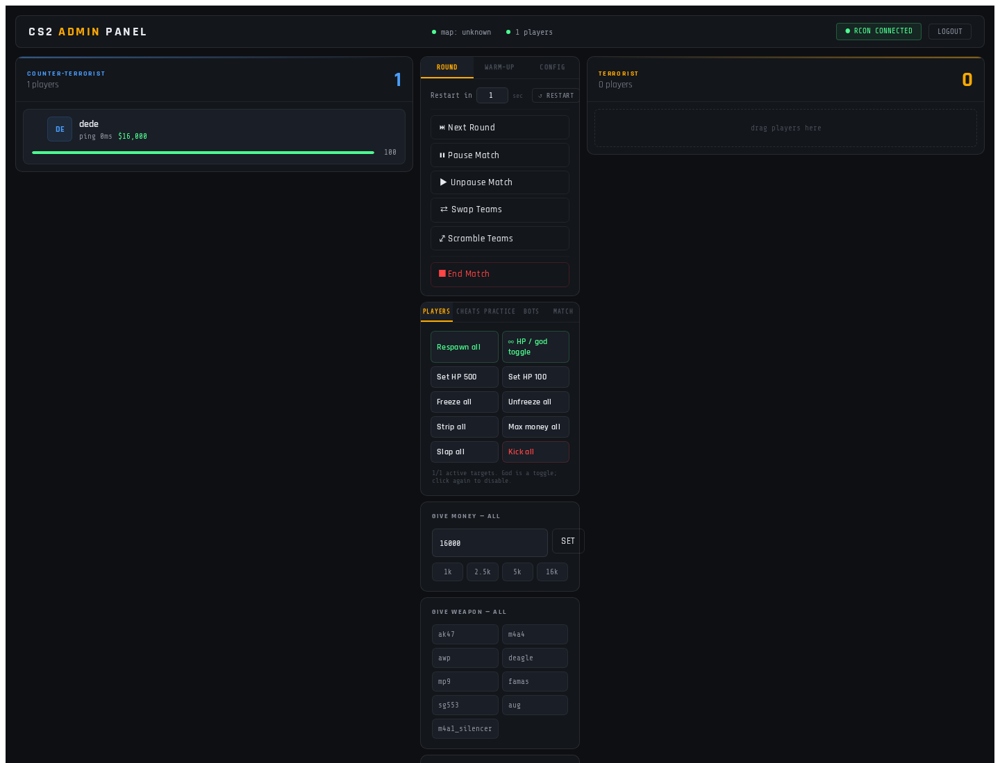
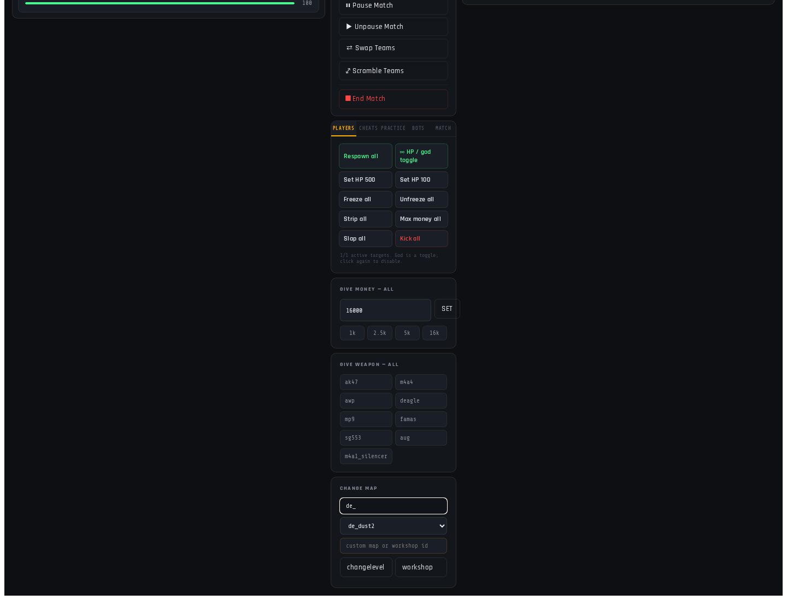

# CS2 Admin Plus Panel

A web-based **Counter-Strike 2 admin panel** for Dathost or any CS2 server with RCON and CounterStrikeSharp. Admin Plus combines a React dashboard, an Express RCON bridge, and a CounterStrikeSharp plugin so server actions can be triggered from buttons instead of typing console commands.



## What It Does

Admin Plus is designed as a click-first control room for CS2 servers:

- View connected players, teams, HP, money, alive/dead state, and current map.
- Drag players between CT and T teams.
- Run player actions such as respawn, set HP, freeze, unfreeze, god mode, slap, strip weapons, kick, give money, and give weapons.
- Run server actions such as round restart, pause/unpause, team swap, warmup controls, match end, map changes, and workshop map loading.
- Toggle practice/admin cheats including infinite ammo, grenade trajectory preview, impacts, buy-anywhere, free armor, no recoil/spread, and full practice presets.
- Manage bots with buttons for add, kick, stop, crouch, and mimic.
- Discover installed maps automatically from the mounted server `maps/` directory.

## UI Screenshots

### Dashboard and Player Panels

The dashboard shows team columns, player cards, HP/money state, drag-and-drop team management, and a central admin command stack.


### Click-Only Admin Controls

The Admin Controls panel groups common actions into tabs: Players, Cheats, Practice, Bots, and Match. These buttons call RCON or plugin-backed commands without requiring manual console input.



### Map Selector and Workshop Loading

The map selector supports filtering, auto-discovered installed maps, custom map names, and numeric workshop IDs. Normal maps use `changelevel`; workshop IDs use `host_workshop_map`.



## Project Structure

```text
admin-plus/
├── frontend/              # React + Vite admin UI
│   ├── src/api/           # Browser API helpers
│   ├── src/components/    # Player cards, controls, popups
│   ├── src/hooks/         # Server polling hooks
│   └── public/weapons/    # Weapon images
├── backend/               # Express API and RCON bridge
│   ├── src/routes/        # /api/players and /api/server routes
│   ├── src/middleware/    # API secret auth
│   └── src/rcon.js        # RCON packet client and parsers
├── plugin/AdminPlus/      # CounterStrikeSharp plugin
└── docs/screenshots/      # README UI screenshots
```

## Architecture

The app runs as one web process in production:

1. `frontend` builds static files to `frontend/dist`.
2. `backend` serves that built UI and exposes `/api/*`.
3. Browser actions call the Express API.
4. Express sends RCON commands to the CS2 server.
5. The `AdminPlus` CounterStrikeSharp plugin provides custom `sm_` commands for player-specific controls.

```text
Browser UI → Express /api → RCON → CS2 Server → CounterStrikeSharp AdminPlus plugin
```

## Requirements

- Node.js 18+
- npm
- .NET 8 SDK for plugin builds
- CS2 server with RCON enabled
- CounterStrikeSharp installed on the server
- FTP mount or another deployment path for `AdminPlus.dll`

A local .NET SDK can be installed under `~/.dotnet` if system packages are unavailable.

## Setup

Install frontend and backend dependencies:

```bash
npm run install:all
```

Create backend config:

```bash
cp backend/.env.example backend/.env
```

Edit `backend/.env`:

```env
PORT=3001
RCON_HOST=your-server-host-or-ip
RCON_PORT=your-rcon-port
RCON_PASSWORD=your-rcon-password
API_SECRET=change_this_to_a_private_value
```

Optional map discovery overrides:

```env
ADMINPLUS_MAPS=de_cache,workshop/123456789/example_map
ADMINPLUS_MAP_DIRS=/run/user/1000/gvfs/ftp:host=your-server.dathost.net,user=your-user/maps
```

## Running the Panel

Build the frontend and start the unified backend/UI server:

```bash
npm run build
npm start
```

Open:

```text
http://localhost:3001
```

Login with the `API_SECRET` from `backend/.env`.

For development:

```bash
npm run dev
```

## Plugin Build and Deployment

Build the CounterStrikeSharp plugin:

```bash
npm run plugin:build
```

Set your local plugin deployment directory, then build and copy the DLL:

```bash
export ADMINPLUS_PLUGIN_DIR="/run/user/1000/gvfs/ftp:host=your-server.dathost.net,user=your-ftp-user/addons/counterstrikesharp/plugins/AdminPlus"
npm run plugin:release
```

`ADMINPLUS_PLUGIN_DIR` should point to the server folder that will contain `AdminPlus.dll`.

After replacing the DLL, reload the plugin or restart the server:

```text
css_plugins unload AdminPlus
css_plugins load AdminPlus
```

## Plugin Commands

The plugin currently provides commands used by the panel, including:

| Command | Purpose |
| --- | --- |
| `sm_playerinfo_all` | Returns player userid, name, team, HP, money, alive state |
| `sm_respawn <userid>` | Respawns a player |
| `sm_setteam <userid> <ct|t|spec>` | Moves a player to a team |
| `sm_givemoney <userid> <amount>` | Sets player money |
| `sm_givemoney_all <amount>` | Sets money for all players |
| `sm_giveweapon <userid> <weapon>` | Gives a weapon to a player |
| `sm_giveweapon_all <weapon>` | Gives a weapon to all players |
| `sm_sethp <userid> <hp>` | Sets player HP |
| `sm_freeze <userid>` / `sm_unfreeze <userid>` | Freezes or unfreezes a player |
| `sm_stripweapons <userid>` | Removes weapons |
| `sm_god <userid>` | Toggles god mode |
| `sm_slap <userid> [damage]` | Slaps a player |

## Map Discovery

The server map dropdown is populated from multiple sources:

1. Built-in official map names.
2. Optional `ADMINPLUS_MAPS` entries.
3. RCON `maps *` output when available.
4. Top-level `.vpk` / `.bsp` files found in mounted `maps/` directories.

The backend filters out non-playable helper files such as `_vanity` map assets and keeps common playable prefixes like `de_`, `cs_`, and `ar_`.

## Security Notes

- Never commit `backend/.env`.
- Keep `API_SECRET` and `RCON_PASSWORD` private.
- Do not paste secrets into screenshots, logs, or PRs.
- Treat the panel as an admin-only tool; expose it only on trusted networks or behind authentication/proxy controls.

## Troubleshooting

### `Cannot GET /api/server/maps`

The frontend is newer than the running backend. Restart the unified backend:

```bash
npm start
```

### RCON connection timeout

Verify the real RCON port from your host dashboard. Game port and RCON port may be different.

### Plugin not responding

Check that the plugin is loaded:

```text
css_plugins list
```

If the plugin was rebuilt, redeploy `AdminPlus.dll` and reload it.

### CounterStrikeSharp `TypeLoadException`

Build the plugin against the same CounterStrikeSharp API version used by the server. This repository pins `CounterStrikeSharp.API` in `plugin/AdminPlus/AdminPlus.csproj`; adjust that version if your server runs a different CounterStrikeSharp release.
